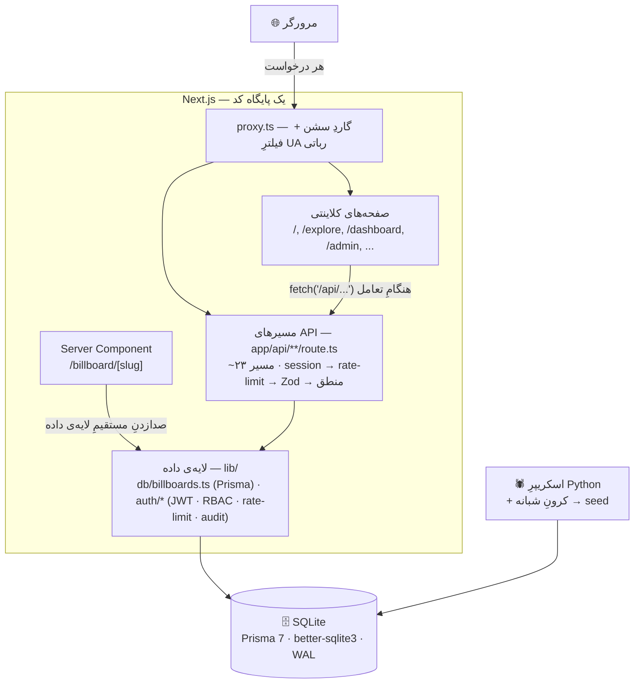

# رساماپ — سامانه‌ی یافتن رسانه‌های تبلیغاتی محیطی

> # ⛔ قبل از هر کاری: برای *دیدن* سایت، `npm run dev` نزن
>
> ### 🔴 `npm run demo`  ← این را بزن
>
> **چرا این‌قدر مهم است؟** حالت `dev` هر صفحه را در همان لحظه‌ای که رویش کلیک
> می‌کنی از صفر کامپایل می‌کند و ۶۷۱۰ فایل را هم watch می‌کند. اندازه‌گیریِ واقعی
> روی همین پروژه، برای اولین بازدید از ۱۰ صفحه:
>
> | حالت | CPU مصرفی |
> |---|---|
> | `npm run dev` | **۹.۷ ثانیه** |
> | `npm run demo` (build + start) | **۰.۱ ثانیه** |
>
> ### 🔴 یعنی ۹۷ برابر فشار کمتر.
>
> روی مک‌بوک ایرِ بدون فن، **دقیقاً همین** تفاوتِ «لپ‌تاپ داغ و پر سر و صدا» با
> «لپ‌تاپ خنک» است. اگر داری بین صفحه‌ها می‌چرخی، ادمین را باز می‌کنی، یا به استاد
> ارائه می‌دهی — همیشه `npm run demo`.
>
> `npm run dev` **فقط** وقتی که داری کد می‌نویسی و به hot-reload نیاز داری.
> (بعد از هر تغییرِ کد، برای دمو دوباره `npm run demo` بزن تا build تازه شود.)
>
> **📝 برای ایجنت/نویسنده‌ی مقاله و پایان‌نامه:** این نکته باید در متنِ گزارش
> بیاید و به خواننده تأکید شود — هم عدد ۹۷ برابر، هم دلیلش. این یک تصمیمِ
> مهندسیِ قابل‌دفاع است، نه یک جزئیاتِ اجرایی.

---

رساماپ یک **فهرستِ آنلاین** از بیلبورد و رسانه‌های محیطی ایران است. تبلیغ‌دهنده
بین چند هزار رسانه جست‌وجو و فیلتر می‌کند، صفحه‌ی جزئیات را می‌بیند، و پس از
ثبت‌نام با شماره‌ی موبایل شماره‌ی تماسِ صاحبِ رسانه را می‌گیرد و مستقیم با او
توافق می‌کند. صاحبانِ رسانه هم رسانه‌ی خود را از راهِ فرمِ «ثبت رسانه» ثبت
می‌کنند و پس از تأییدِ مدیر منتشر می‌شود — درآمدِ پلتفرم از همین سمت است، نه از
اجاره‌کننده. یک پنلِ مدیریتِ جداگانه برای رسیدگی به رسانه‌ها و تأییدِ آگهی‌ها
وجود دارد. رابطِ کاربری فارسی و راست‌به‌چپ است.

> رساماپ مالکِ رسانه‌ها نیست و واسطه‌ی مالیِ اجاره نیست؛ به همین دلیل جریانِ
> «رزرو آنلاین» ندارد. دلیلِ این تصمیم در
> [`docs/engineering-decisions.md`](./docs/engineering-decisions.md) §۱۷ آمده است.

این یک پروژه‌ی پایان‌نامه‌ی کارشناسی است. هدف، محصولی است کارآمد، تمیز و امن که در
جلسه‌ی دفاع دوام بیاورد — نه زیرساختِ نمایشی.

---

## چرا Next.js

رساماپ در هسته‌اش یک سایتِ **محتوایی و قابلِ نمایه‌شدن** است: صفحه‌ی هر رسانه باید
برای موتورهای جست‌وجو قابلِ خواندن باشد و سریع بالا بیاید. یک تکِ‌اپِ کلاینتیِ
خالص (SPA) اینجا ضعف دارد، چون محتوا را پس از بارگذاریِ جاوااسکریپت می‌سازد.

انتخابِ دیگر این بود که یک فرانت‌اندِ جدا و یک بک‌اندِ جدا (مثلاً Django) بسازیم؛
اما آن یعنی دو پروژه، دو استقرار، پیکربندیِ CORS، و هماهنگ‌نگه‌داشتنِ دو مجموعه
تایپ. برای یک توسعه‌دهنده و یک مهلتِ کوتاه، هزینه‌اش زیاد است.

Next.js با App Router هر دو نیاز را در **یک پایگاه کد** پوشش می‌دهد:

- صفحه‌ها روی سرور رندر می‌شوند، پس محتوا از همان اولین پاسخ آماده است و
  نمایه‌شدن مشکلی ندارد.
- مسیرهای API در همان پروژه کنارِ صفحه‌ها تعریف می‌شوند، پس یک استقرار داریم و یک
  مدلِ تایپ که هم سرور و هم کلاینت از آن استفاده می‌کنند.
- الگوی **Server Component** اجازه می‌دهد یک صفحه هنگامِ رندر مستقیم از پایگاه
  داده بخواند، بدونِ ساختنِ یک درخواستِ HTTP به خودِ سرور.

---

## ترکیب با API — دو مسیرِ داده

داده در پروژه از دو راه جابه‌جا می‌شود، و هر راه جایی به کار می‌رود که سریع‌تر است:

1. **مرورگر به API.** همه‌ی صفحه‌های کلاینتی و بخش‌های تعاملی با `fetch("/api/...")`
   کار می‌کنند، چون پس از بارگذاریِ صفحه به داده‌ی تازه نیاز دارند — فیلتر،
   صفحه‌بندی، ثبتِ آگهی، ویرایشِ مدیر.
2. **سرور به پایگاه داده.** فقط صفحه‌ی جزئیاتِ رسانه (`/billboard/[slug]`) یک
   Server Component است و هنگامِ رندر مستقیم `getBillboardBySlug()` را صدا می‌زند —
   یک پرش، بدونِ تبدیلِ داده به JSON و برگرداندنش، بدونِ درخواستِ شبکه‌ی سرور به
   خودش. این همان الگویی است که مستنداتِ Next.js توصیه می‌کند.

هر دو مسیر از **یک لایه‌ی داده** (`lib/db/billboards.ts`) عبور می‌کنند؛ پس یک منبعِ
حقیقت داریم و منطق در دو جا تکرار نمی‌شود. شرحِ کامل، جدولِ مقایسه‌ی کارایی و
تشبیهِ «رستوران/آشپزخانه» در [`docs/architecture.md`](./docs/architecture.md) آمده
است.

---

## پایگاه داده — چرا SQLite، و بعد چه

**از آرایه‌ی ثابت تا پایگاه داده.** داده‌ی بیلبوردها اولش آرایه‌ای ثابت داخلِ
`lib/data.ts` بود. برای نمونه‌سازی خوب بود، اما زود معلوم شد داده‌ی این پروژه ثابت
نمی‌ماند: اسکریپر رکوردِ تازه می‌آورد، مدیر ویرایش و حذف می‌کند، کاربر آگهیِ تازه
ثبت می‌کند. یک فایلِ کد را نمی‌شود نوشت. پس به یک پایگاه داده‌ی واقعی رفتیم. امروز
`lib/data.ts` فقط هنگامِ seed خوانده می‌شود تا داده‌ی اولیه یک‌بار داخلِ پایگاه
داده ریخته شود؛ هیچ صفحه یا مسیرِ دیگری به آن دست نمی‌زند.

**چرا SQLite.** این یک تصمیمِ مهندسی است، نه یک سازش. SQLite یک موتورِ کاملِ SQL
با تضمینِ ACID است — همانی که در اندروید، مرورگرها و حتی سامانه‌های پروازی به کار
می‌رود — با این تفاوت که به‌جای یک سرورِ جدا، کتابخانه‌ای است که مستقیم روی یک فایل
کار می‌کند. برای بارِ کاریِ این پروژه دقیقاً همان چیزی است که لازم داریم:

- **خواندن‌محور است.** کاتالوگی با حدود ۳۵۰۰ رکورد که مدام فهرست و فیلتر می‌شود.
  SQLite در خواندن بسیار سریع است و با حالتِ WAL چند خواننده‌ی هم‌زمان بدونِ قفل‌شدن
  کار می‌کنند.
- **نوشتن‌هایش کم و تراکنشی‌اند.** نوشتن‌های حساس — ثبتِ آگهی، تأییدِ آن، و
  به‌روزرسانیِ میانگینِ امتیاز پس از هر نظر — کم پیش می‌آیند و داخلِ یک تراکنش
  سریال می‌شوند.
- **روی یک ماشین اجرا می‌شود.** برای دفاع، اپ روی یک سرور بالا می‌آید؛ نه چند سرورِ
  اپ که به یک پایگاه داده‌ی مشترک وصل شوند، نه نیاز به همتاسازی.
- **هزینه‌ی عملیاتی‌اش صفر است.** یک فایل، بدونِ نصبِ سرور، بدونِ کاربر و رمز،
  بدونِ پورت. گرفتنِ نسخه‌ی پشتیبان یعنی کپیِ یک فایل (`npm run db:backup`، با
  بازیابیِ آزموده‌شده).

آنچه آگاهانه کنار گذاشتیم: نوشتنِ واقعاً هم‌زمان، دسترسی از چند ماشین، و همتاسازیِ
درون‌ساخت. هیچ‌کدام در این مقیاس مشکل‌ساز نیست. نخستین جایی که SQLite کم می‌آورد،
زیرِ بارِ سنگینِ نوشتن است — قفلِ تک‌نویسنده، که اپ روی `POST /api/listings` به آن
می‌خورد — و این را در `docs/architecture.md` صریح گفته‌ایم.

**Prisma چیست.** لایه‌ی دسترسی به داده است: هم نگاشتِ شیء به رابطه (ORM)، هم ابزارِ
مهاجرت. ساختارِ جدول‌ها در یک فایل تعریف می‌شود (`prisma/schema.prisma`)، Prisma از
رویش یک کلاینتِ نوع‌امن می‌سازد (کوئری‌ها هنگامِ کامپایل بررسی می‌شوند، نه هنگامِ
اجرا)، و `prisma migrate` تغییرهای ساختار را نسخه‌بندی و بازپخش‌پذیر می‌کند. مهم‌تر
اینکه کلِ اپ فقط از راهِ یک ماژول (`lib/db/billboards.ts`) با پایگاه داده حرف
می‌زند و هیچ کوئریِ رشته‌ای در پروژه نیست.

**قدمِ بعدی.** چون همه‌چیز از Prisma و یک ماژولِ واحد عبور می‌کند، رفتن به
PostgreSQL در آینده یعنی: عوض‌کردنِ نوعِ منبع و رشته‌ی اتصال، اجرای مهاجرت‌ها،
تمام — بدونِ بازنویسیِ حتی یک کوئری. برای پروداکشنِ واقعی (چند نویسنده‌ی هم‌زمان،
چند سرورِ اپ، پشتیبان‌گیریِ مدیریت‌شده) PostgreSQL انتخابِ درست است. این یک
«بعداً»ی برنامه‌ریزی‌شده است، نه یک کمبود.

---

## نقشه‌ی معماری

کلِ اپلیکیشن — رابطِ کاربری، مسیرهای API، و رندرِ سمت سرور — در یک پایگاه کد است.
کد به لایه‌های آشنا بخش شده است.



### فایل به لایه

| فایل / پوشه | لایه | نقش |
|---|---|---|
| `app/page.tsx`, `explore/`, `dashboard/`, `analytics/`, `admin/`, `list-media/`, `compare/` | رابطِ کاربری | صفحه‌های کلاینتی؛ داده را هنگامِ اجرا با `fetch("/api/...")` می‌گیرند |
| `app/billboard/[slug]/page.tsx` | رابطِ کاربری | Server Component؛ هنگامِ رندر مستقیم `getBillboardBySlug()` را صدا می‌زند |
| `components/*.tsx` | رابطِ کاربری | اجزای نمایشی؛ تایپ‌ها را از `lib/types.ts` می‌گیرند؛ چند تا خودشان `fetch` دارند |
| `app/api/**/route.ts` | API | ~۲۳ مسیر؛ همه با ترتیبِ `session → rate-limit → Zod → منطق` و `Zod.safeParse()` |
| `proxy.ts` | API | گاردِ سشن روی مسیرهای مدیر و کاربر، پیش از رسیدن به مسیر |
| `lib/db/billboards.ts`, `lib/db/client.ts` | لایه‌ی داده | تنها راهِ خواندن و نوشتنِ رسانه؛ API و Server Component هر دو از این استفاده می‌کنند |
| `lib/auth/*` | لایه‌ی داده | سشن (JWT با `jose`)، محدودیتِ نرخ، ثبتِ ممیزی، نقش‌ها، `bcrypt` |
| `lib/types.ts` | لایه‌ی داده | تایپ‌های دامنه + `typeLabels`؛ بدونِ داده، قابلِ import از هر جا |
| `prisma/schema.prisma`, `prisma/migrations/` | پایگاه داده | ساختارِ جدول‌ها و مهاجرت‌ها |
| `lib/data.ts` + `scraper/data/billboards.json` | seed | آرایه‌های اولیه؛ فقط `prisma/seed.ts` آن را می‌خواند |
| `scraper/` | اسکریپر | جمع‌آوریِ آگهی از سایت‌های ایرانی + ژئوکدینگ |

نقشه‌ی کامل‌ترِ فایل‌ها در [`docs/project-reference.md`](./docs/project-reference.md)
و شرحِ هر تصمیمِ مهندسی در
[`docs/engineering-decisions.md`](./docs/engineering-decisions.md).

---

## امنیت و صحت — خلاصه

- هر مسیرِ API با ترتیبِ ثابت: بررسیِ سشن، محدودیتِ نرخ، اعتبارسنجیِ Zod، سپس منطق.
- احراز هویت با JWTِ HS256 در کوکیِ HttpOnly؛ `bcrypt` با هزینه‌ی ۱۲؛ پاسخِ یکسان
  برای «رمزِ غلط» و «کاربرِ ناموجود» تا نامِ کاربری لو نرود.
- نقش‌ها: `viewer < editor < admin < super_admin` به‌علاوه‌ی `user`؛ مرزِ امنیت
  خودِ مسیر است، نه رابطِ کاربری.
- محدودیتِ نرخ بر پایه‌ی IP و کاربر؛ IP از `lib/auth/client-ip.ts` گرفته می‌شود، نه
  از نخستین مقدارِ `X-Forwarded-For` که قابلِ جعل است.
- ثبتِ آگهی: پشتیبانیِ `Idempotency-Key` تا دوباره‌فرستادنِ یک درخواست رکوردِ دوم
  نسازد؛ تصمیمِ تأیید/رد فقط یک‌بار پذیرفته می‌شود (بارِ دوم `409`).
- آپلودِ تصویر: نوعِ فایل از روی بایت‌های ابتداییِ خودِ فایل تشخیص داده می‌شود، نه
  از چیزی که مرورگر ادعا می‌کند؛ نامِ فایل را سرور می‌سازد.
- ضدِ کپی‌برداری: مسدودسازیِ عاملِ کاربرِ ربات‌ها، سقفِ نرخ روی صفحه‌های کاتالوگ
  و نه فقط API، محافظت از تصاویر در برابرِ hotlink، و سقفِ ۴۸ رکورد در هر صفحه.
- لاگِ ساخت‌یافته و کدِ کوتاهِ خطا برای کاربر؛ ثبتِ پایدارِ کارهای مدیر در جدولِ
  `audit_logs`.
- هدرهای امنیتی و CSP در `next.config.ts`.

ارزیابیِ ۱۳ لایه در [`docs/AUDIT.md`](./docs/AUDIT.md) و ممیزیِ وابستگی‌ها در
[`docs/security-audit.md`](./docs/security-audit.md).

---

## اجرا

```bash
npm install                    # postinstall هم Prisma Client را می‌سازد
cp .env.example .env           # مقادیر را پر کن (اسکریپت‌های مستقل `.env` را می‌خوانند، نه `.env.local`)
npx prisma migrate deploy      # ساختِ پایگاه داده و جدول‌ها
npm run db:seed                # داده‌ی اولیه (~۳۵۰۰ رسانه — `scraper/data/billboards.json` در ریپو هست)
npm run demo                   # build + start → http://localhost:3000  (برای کدنویسی: npm run dev)
```

متغیرهای لازم (نام‌ها در `.env.example`): `DATABASE_URL`، `AUTH_SECRET` (دستِ‌کم
۳۲ نویسه)، `ADMIN_EMAIL`، `ADMIN_PASSWORD_HASH`، `ADMIN_NAME`، و برای لایه‌ی نقشه
`NESHAN_API_KEY` و `NEXT_PUBLIC_NESHAN_KEY`. اگر یکی از موارد الزامی نباشد، سرور
همان هنگامِ بالاآمدن با پیامی روشن متوقف می‌شود (`lib/env.ts`).

برای تستِ دستی، حساب‌های آماده در
[`docs/demo-accounts.md`](./docs/demo-accounts.md) هستند (‏`npm run db:seed:demo:full`).

### چهار دستورِ اجرا — تفاوتشان

«build» یک **حالتِ اجرا نیست، یک مرحله است**. حالتِ production همان `next start`
است و چیزِ جداگانه‌ای ندارد.

| دستور | معادلِ Next | چه می‌کند | سایت بالا می‌آید؟ | کِی |
|---|---|---|---|---|
| `npm run dev` | `next dev` | سرورِ توسعه: هر صفحه را لحظه‌ی کلیک از صفر کامپایل می‌کند، ۶۷۱۰ فایل را watch می‌کند، hot-reload دارد | ✅ | **فقط** هنگامِ کدنویسی |
| `npm run build` | `next build` | فقط **می‌سازد** (خروجی در `.next/`)، بعد تمام می‌شود و به ترمینال برمی‌گردد | ❌ | یک‌بار پیش از `start`؛ یا برای اطمینان از نبودِ خطا |
| `npm run start` | `next start` | سایت را از روی buildِ آماده اجرا می‌کند — **همین حالتِ production است** | ✅ | اجرای واقعی؛ اگر build از قبل هست ~۱ ثانیه بالا می‌آید |
| `npm run demo` | `next build && next start` | همان دوتای بالا پشتِ سر هم | ✅ | ساده‌ترین راه؛ بعد از هر تغییرِ کد |

فشارِ CPU: `dev` = ۹.۷ ثانیه در برابرِ `demo` = ۰.۱ ثانیه برای اولین بازدید از ۱۰
صفحه (**~۹۷ برابر**). `start` و `demo` از نظرِ فشار **یکسان‌اند** — هر دو `next
start` را اجرا می‌کنند؛ تنها تفاوت، مرحله‌ی buildِ اولیه است. شرح در
[`docs/engineering-decisions.md`](./docs/engineering-decisions.md) §۲۲.

```
بارِ اول، یا بعد از تغییرِ کد:   npm run demo     (~۱۵ ثانیه، شاملِ build)
دفعاتِ بعد، بدونِ تغییرِ کد:      npm run start    (~۱ ثانیه)
```

### دستورها

```bash
npm run demo                # build + start — برای دیدن یا ارائه‌ی سایت
npm run start               # اجرا از روی buildِ موجود (حالتِ production)
npm run dev                 # سرورِ توسعه — فقط هنگامِ کدنویسی
npm run build               # فقط ساخت؛ باید بدونِ خطا پاس شود
npm run lint
npm test                    # سوییتِ آزمونِ API — ۳۷ آزمون
npm run bench               # سنجشِ بار (سرورِ توسعه باید بالا باشد)

npx prisma migrate deploy   # اعمالِ مهاجرت‌ها
npm run db:seed             # داده‌ی اولیه
npm run db:seed:demo:full   # حساب‌ها و رکوردهای دمو
npm run db:backup           # نسخه‌ی پشتیبانِ آنلاینِ SQLite → backups/
npm run db:studio           # Prisma Studio
```

---

## مستندات

| فایل | محتوا |
|---|---|
| [`docs/presentation-summary.md`](./docs/presentation-summary.md) | خلاصه‌ی دفاع: چه حل شد، چه کنار گذاشته شد و چرا، محدودیت‌ها |
| [`docs/architecture.md`](./docs/architecture.md) | دو مسیرِ داده، تشبیهِ آشپزخانه، جدولِ کارایی |
| [`docs/engineering-decisions.md`](./docs/engineering-decisions.md) | هر سیستمِ پروژه: چیست، چه ساختاری می‌سازد، چرا، کجا |
| [`docs/api.md`](./docs/api.md) | مرجعِ کاملِ مسیرهای API (در اپ هم: `/api-docs`) |
| [`docs/project-reference.md`](./docs/project-reference.md) | نقشه‌ی فایل، ساختارِ جدول‌ها، احراز هویت |
| [`docs/AUDIT.md`](./docs/AUDIT.md) · [`PLAN.md`](./PLAN.md) | ارزیابیِ آمادگیِ پروداکشن و کارهای باقی‌مانده |
| [`RUNBOOK.md`](./RUNBOOK.md) · [`PRE_DEPLOY_CHECKLIST.md`](./PRE_DEPLOY_CHECKLIST.md) | رویه‌ی بازیابی و چک‌لیستِ پیش از استقرار |
| [`scraper/README.md`](./scraper/README.md) | منابعِ اسکریپر، زمان‌بندی، ژئوکدینگ |
