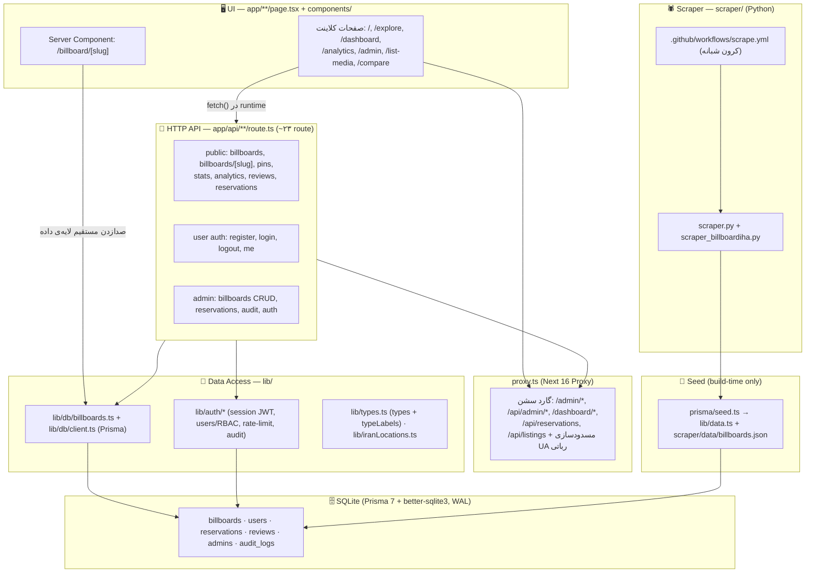

# Rasamap — سامانه یافتن و مدیریت بیلبورد

Next.js App Router + یک اسکریپر پایتون برای جمع‌آوری آگهی‌های بیلبورد از چند سایت ایرانی و نمایش/مدیریت آن‌ها.

## اجرا (Getting Started)

```bash
npm install
npm run dev   # http://localhost:3000
```

> ⚠️ **دیتابیس و seed:** اپ در زمان اجرا از SQLite (از طریق Prisma) می‌خواند — نه از فایل.
> فقط اسکریپت seed (`prisma/seed.ts`) هنوز `lib/data.ts` و `scraper/data/billboards.json` را
> import می‌کند تا داده‌ی اولیه را داخل دیتابیس بریزد. `npm run dev` / `npm run build` به
> `billboards.json` نیازی ندارند (هیچ صفحه یا route آن را import نمی‌کند). برای seed روی یک کپی
> تازه، یا اسکریپر را یک‌بار اجرا کن یا `scraper/data/billboards.json` را با `[]` بساز.

### ساخت زیپ export

```bash
zip -r project-ai.zip . \
  -x "node_modules/*" \
  -x ".next/*" \
  -x ".git/*" \
  -x "public/images/*" \
  -x "scraper/data/*" \
  -x "*.log" \
  -x ".DS_Store" \
  -x "__MACOSX/*"
```

این‌ها عمداً کنار گذاشته می‌شوند (dependencies، build cache، عکس‌های اسکرِیپ‌شده، خروجی زنده‌ی اسکریپر، فایل‌های OS) —
یعنی هر کپی تازه از این زیپ به همان مشکل بالا (نبود `billboards.json`) می‌خورد؛ این رفتار عادی است، نه باگ.

---

## دیتابیس (Prisma + SQLite)

پروژه از Prisma با آداپتور `better-sqlite3` استفاده می‌کند. فایل `.env` باید متغیر `DATABASE_URL` را داشته باشد
(مثلاً `DATABASE_URL="file:./prisma/dev.db"`)، وگرنه اسکریپت‌های مستقل زیر (که مستقیم با `tsx` اجرا می‌شوند و
از `prisma.config.ts` رد نمی‌شوند) با ارور `Cannot read properties of undefined (reading 'replace')` fail می‌کنند —
چون آداپتور یک `DATABASE_URL` خالی/`undefined` می‌گیرد.

```bash
npx prisma migrate dev --name init   # ساخت دیتابیس + جدول‌ها
npm run db:seed                      # seed کردن داده اولیه (lib/data.ts + billboards.json)
npm run db:studio                    # باز کردن Prisma Studio روی دیتابیس
```

### تست dedupe روی داده‌های موجود دیتابیس (فقط گزارش، چیزی حذف نمی‌شه)

```bash
npm run db:dedupe
```

اگه نتیجه‌ش رو تأیید کردی و خواستی واقعاً پاک کنه:

```bash
npm run db:dedupe -- --apply
```

### پرکردن مختصات ناقص

```bash
npm run db:backfill-coords
```

(نیاز به `NESHAN_API_KEY` توی `.env.local` داره، همون کلیدی که خود اسکرپر استفاده می‌کنه)

---

## نقشه معماری (Architecture Map)

اپ full-stack Next.js است: UI، HTTP API و رندر سمت سرور در یک کدبیس. جزئیات کامل + آنالوژی
«رستوران/آشپزخانه» + جدول مقایسه‌ی پرفورمنس در [`docs/architecture.md`](./docs/architecture.md).
مرجع کامل endpointها در [`docs/api.md`](./docs/api.md).



### جدول فایل → لایه

| فایل / پوشه | لایه | مسئولیت |
|---|---|---|
| `app/page.tsx`, `app/explore/page.tsx`, `app/dashboard/page.tsx`, `app/analytics/page.tsx`, `app/list-media/page.tsx`, `app/compare/page.tsx` | **UI** | صفحات `"use client"` — داده را در runtime با `fetch("/api/...")` می‌گیرند |
| `app/billboard/[slug]/page.tsx` | **UI** | React **Server Component** — در رندر سمت سرور مستقیم `getBillboardBySlug()` را صدا می‌زند (الگوی پیشنهادی Next.js؛ سریع‌تر از fetch به API خودی) |
| `app/admin/page.tsx`, `app/admin/login/page.tsx` | **UI** | داشبورد ادمین؛ `fetch("/api/admin/*")`، پشتِ گارد `proxy.ts` |
| `components/*.tsx` | **UI** | کامپوننت‌های نمایشی. تایپ‌ها از `lib/types.ts`؛ چند تا (`BookingModal`, `ReviewsSection`, پنل‌های ادمین) خودشان `fetch("/api/...")` دارند |
| `app/api/**/route.ts` | **API** | ~۲۳ Route Handler: عمومی (billboards، stats، analytics، reviews، reservations)، احراز کاربر، و ادمین (CRUD + audit). همه با Zod `.safeParse()` |
| `proxy.ts` | **API (Proxy مشترک)** | گارد سشن روی `/admin/*`, `/api/admin/*`, `/dashboard/*`, `/api/reservations`, `/api/listings` + مسدودسازی UA رباتی — قبل از route اجرا می‌شود |
| `lib/db/billboards.ts`, `lib/db/client.ts` | **Data Access** | تنها راه خواندن/نوشتن بیلبورد (Prisma). هم API و هم Server Component از این استفاده می‌کنند — یک منبع حقیقت |
| `lib/auth/session.ts`, `rate-limit.ts`, `audit.ts`, `users.ts` | **Data Access** | سشن (JWT با `jose`)، rate-limit، audit، RBAC (`viewer<editor<admin<super_admin`), bcrypt |
| `lib/types.ts` | **Data Access** | تایپ‌های دامنه (`Billboard`, ...) + `typeLabels`/`typeIcons`. بدون دیتا — از هر جا import می‌شود |
| `lib/iranLocations.ts`, `lib/admin/types.ts` | **Data Access** | داده‌ی مرجع استان/شهر + توابع مختصات؛ تایپ‌های آمار ادمین |
| `prisma/schema.prisma`, `prisma/migrations/` | **DB** | اسکیمای SQLite: `billboards`, `users`, `reservations`, `reviews`, `admins`, `audit_logs` + ایندکس‌های ترکیبی |
| `lib/data.ts` + `scraper/data/billboards.json` | **DB (seed)** | آرایه‌های استاتیک/scraped + JSON ۴MB. **فقط `prisma/seed.ts`** آن را import می‌کند — در build graph اپ نیست |
| متغیرهای `ADMIN_EMAIL` / `ADMIN_PASSWORD_HASH` (در `.env.local`) | **DB** | حساب ادمین اولیه (تا وقتی جدول `admins` پر شود) |
| `scraper/scraper.py`, `scraper/scraper_billboardiha.py` | **Scraper** | جمع‌آوری آگهی بیلبورد از سایت‌های ایرانی |
| `scraper/regeocode_cache.py` | **Scraper** | ژئوکدینگ آدرس با Neshan + کش |
| `.github/workflows/scrape.yml` | **Scraper (CI)** | اجرای شبانه‌ی اسکریپر |
| `next.config.ts`, `tsconfig.json`, `eslint.config.mjs`, `package.json` | **تنظیمات/ابزار** | پیکربندی build/lint؛ headerهای امنیتی + CSP در `next.config.ts` |
| `AGENTS.md`, `CLAUDE.md` | **مستندات دستیار کد** | دستورالعمل داخلی برای ابزارهایی مثل Claude Code |

### معماری داده — دو مسیر

پروژه دو مسیر داده دارد و هر کدام جایی به کار می‌رود که سریع‌تر است:

1. **مرورگر → HTTP API.** همه‌ی صفحات کلاینت و کامپوننت‌های تعاملی با `fetch("/api/...")` کار
   می‌کنند، چون بعد از لود صفحه به داده‌ی تازه و تعاملی نیاز دارند (فیلتر، صفحه‌بندی، رزرو).
2. **سرور → دیتابیس (مستقیم).** صفحه‌ی `/billboard/[slug]` یک React Server Component است که
   موقع رندر مستقیم `getBillboardBySlug()` را صدا می‌زند: یک hop، بدون serialize کردن JSON،
   بدون درخواست HTTP سرور به خودش. این الگوی پیشنهادی مستندات Next.js برای data fetching در
   Server Component است.

هر دو مسیر از یک لایه‌ی داده (`lib/db/billboards.ts`) عبور می‌کنند — یک منبع حقیقت، بدون کد
تکراری. یک فریم‌ورک headless (مثل Django + DRF) فقط مسیر API را دارد چون UIِ رندرشده‌ی سمت
سرور ندارد؛ Next.js هر دو را دارد. `GET /api/billboards/[slug]` هم موجود است تا هر resource
یک REST endpoint داشته باشد. جزئیات کامل + جدول مقایسه‌ی پرفورمنس در
[`docs/architecture.md`](./docs/architecture.md).

### دیتابیس

SQLite واقعی از طریق Prisma 7 (آداپتور `better-sqlite3`، حالت WAL). جدول‌ها: `billboards`,
`users`, `reservations`, `reviews`, `admins`, `audit_logs`. مهاجرت‌ها در `prisma/migrations/`.
`lib/db/billboards.ts` تنها لایه‌ی دسترسی است — هیچ route یا صفحه‌ای مستقیم `prisma` را صدا
نمی‌زند مگر از این ماژول. حساب ادمین فعلاً از env می‌آید (جدول `admins` برای مهاجرت بعدی رزرو شده).

---

## اسکریپر

جزئیات کامل منابع، زمان‌بندی، پاک‌سازی آگهی‌های منقضی و ژئوکدینگ در [`scraper/README.md`](./scraper/README.md).
