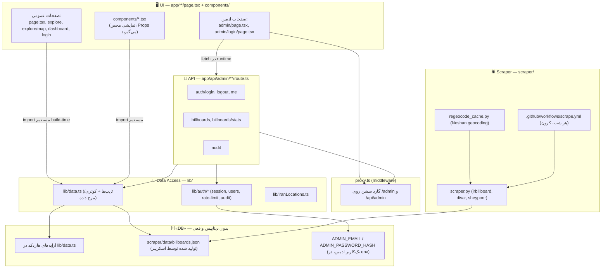

# Rasamap — سامانه یافتن و مدیریت بیلبورد

Next.js App Router + یک اسکریپر پایتون برای جمع‌آوری آگهی‌های بیلبورد از چند سایت ایرانی و نمایش/مدیریت آن‌ها.

## اجرا (Getting Started)

```bash
npm install
npm run dev   # http://localhost:3000
```

> ⚠️ **پیش‌نیاز اجرا:** `lib/data.ts` مستقیماً فایل `scraper/data/billboards.json` را ایمپورت می‌کند
> (`import scrapedRaw from "../scraper/data/billboards.json"`). این فایل توسط اسکریپر ساخته می‌شود و
> **عمداً از زیپ‌های export پروژه کنار گذاشته می‌شود** (به‌خاطر حجم/دیتای زنده — ببین دستور zip زیر).
> یعنی روی یک کپی تازه (از زیپ) قبل از `npm run dev` باید یا اسکریپر را یک‌بار اجرا کنی (`scraper/README.md`)
> یا یک فایل خالی `scraper/data/billboards.json` با محتوای `[]` بسازی، وگرنه build/dev fail می‌شود.

### ساخت زیپ export

```bash
zip -r project-ai.zip . \
  -x "node_modules/*" \
  -x ".next/*" \
  -x ".git/*" \
  -x "public/images/*" \
  -x "scraper/data/*" \
  -x "*.log" \
  -x ".DS_Store" \
  -x "__MACOSX/*"
```

این‌ها عمداً کنار گذاشته می‌شوند (dependencies، build cache، عکس‌های اسکرِیپ‌شده، خروجی زنده‌ی اسکریپر، فایل‌های OS) —
یعنی هر کپی تازه از این زیپ به همان مشکل بالا (نبود `billboards.json`) می‌خورد؛ این رفتار عادی است، نه باگ.

---

## دیتابیس (Prisma + SQLite)

پروژه از Prisma با آداپتور `better-sqlite3` استفاده می‌کند. فایل `.env` باید متغیر `DATABASE_URL` را داشته باشد
(مثلاً `DATABASE_URL="file:./prisma/dev.db"`)، وگرنه اسکریپت‌های مستقل زیر (که مستقیم با `tsx` اجرا می‌شوند و
از `prisma.config.ts` رد نمی‌شوند) با ارور `Cannot read properties of undefined (reading 'replace')` fail می‌کنند —
چون آداپتور یک `DATABASE_URL` خالی/`undefined` می‌گیرد.

```bash
npx prisma migrate dev --name init   # ساخت دیتابیس + جدول‌ها
npm run db:seed                      # seed کردن داده اولیه (lib/data.ts + billboards.json)
npm run db:studio                    # باز کردن Prisma Studio روی دیتابیس
```

### تست dedupe روی داده‌های موجود دیتابیس (فقط گزارش، چیزی حذف نمی‌شه)

```bash
npm run db:dedupe
```

اگه نتیجه‌ش رو تأیید کردی و خواستی واقعاً پاک کنه:

```bash
npm run db:dedupe -- --apply
```

### پرکردن مختصات ناقص

```bash
npm run db:backfill-coords
```

(نیاز به `NESHAN_API_KEY` توی `.env.local` داره، همون کلیدی که خود اسکرپر استفاده می‌کنه)

---

## نقشه معماری (Architecture Map)

پروژه به ۵ لایه تقسیم می‌شود. مرز هر لایه همان مرز پوشه‌هاست — چیزی جابه‌جا نشده چون از قبل تمیز بود؛
فقط این‌جا مستند و صریح شده.



### جدول فایل → لایه

| فایل / پوشه | لایه | مسئولیت |
|---|---|---|
| `app/page.tsx`, `app/explore/page.tsx`, `app/explore/map/page.tsx`, `app/dashboard/page.tsx`, `app/login/page.tsx`, `app/list-media/page.tsx` | **UI** | صفحات عمومی سایت. همه `"use client"` هستند و **مستقیماً** از `lib/data.ts` دیتا می‌گیرند (نه از API) |
| `app/admin/page.tsx`, `app/admin/login/page.tsx` | **UI** | داشبورد ادمین؛ برخلاف بقیه صفحات، فقط با `fetch()` به لایه API وصل می‌شود |
| `components/*.tsx` | **UI** | کامپوننت‌های نمایشی. اکثراً فقط تایپ `Billboard` را ایمپورت می‌کنند؛ استثنا: `AnalyticsTab.tsx` که مستقیم آرایه `billboards` را هم می‌خواند |
| `app/layout.tsx`, `app/globals.css`, `lib/theme.tsx` | **UI (زیرساخت)** | لایوت ریشه و تم؛ جزو UI است نه Data Access، چون هیچ دیتای دامنه‌ای نگه نمی‌دارد |
| `app/api/admin/auth/login/route.ts`, `.../logout`, `.../me` | **API** | ورود/خروج ادمین، ست‌کردن کوکی سشن |
| `app/api/admin/billboards/route.ts`, `.../stats/route.ts` | **API** | لیست/فیلتر/صفحه‌بندی بیلبوردها و آمار — فقط مصرف‌کننده‌شان داشبورد ادمین است |
| `app/api/admin/audit/route.ts` | **API** | خروجی لاگ‌های audit برای پنل ادمین |
| `proxy.ts` | **API (میان‌افزار مشترک)** | گارد سشن روی مسیرهای `/admin/*` و `/api/admin/*` — قبل از هر دو لایه UI و API اجرا می‌شود |
| `lib/data.ts` | **Data Access** | تعریف تایپ `Billboard`، کوئری/مرج بین داده‌ی هاردکد و داده‌ی اسکرِیپ‌شده (`everyBillboard`) |
| `lib/auth/session.ts`, `rate-limit.ts`, `audit.ts`, `users.ts` | **Data Access** | منطق سشن (JWT با `jose`)، rate-limit، ثبت audit، احراز کاربر (bcrypt) |
| `lib/admin/types.ts` | **Data Access** | تایپ‌های مشترک آمار ادمین |
| `lib/iranLocations.ts` | **Data Access** | دادهٔ مرجع استاتیک استان/شهر + توابع کمکی مختصات |
| *(آرایه‌های `billboards` و `extraBillboards` داخل `lib/data.ts`)* | **«DB»** | دادهٔ اولیه/دمو، هاردکد در کد — نه یک دیتابیس واقعی |
| `scraper/data/billboards.json` *(تولیدشده، در این نسخه از پروژه غایب)* | **«DB»** | خروجی اسکریپر؛ توسط `lib/data.ts` در build ایمپورت می‌شود |
| متغیرهای محیطی `ADMIN_EMAIL` / `ADMIN_PASSWORD_HASH` (در `.env.local`) | **«DB»** | تنها کاربر ادمین سیستم؛ هیچ جدول کاربر واقعی وجود ندارد |
| `scraper/scraper.py` | **Scraper** | ارکستریتور اصلی؛ منابع فعال: irbillboard.com, divar.ir, sheypoor.com |
| `scraper/scraper_billboardiha.py` | **Scraper** | منبع غیرفعال (robots.txt مسدودش کرده)؛ `scraper.py` وارد کردنش را با try/except مدیریت می‌کند |
| `scraper/regeocode_cache.py` | **Scraper** | ژئوکدینگ آدرس‌ها با Neshan + کش |
| `.github/workflows/scrape.yml` | **Scraper (CI)** | اجرای شبانه‌ی اسکریپر و کامیت خودکار `scraper/data/` |
| `next.config.ts`, `tsconfig.json`, `eslint.config.mjs`, `postcss.config.mjs`, `package.json` | **تنظیمات/ابزار** | جزو هیچ‌کدام از ۵ لایه نیست؛ پیکربندی build/lint |
| `AGENTS.md`, `CLAUDE.md` | **مستندات برای دستیار کدنویسی** | دستورالعمل داخلی برای ابزارهایی مثل Claude Code، ربطی به معماری اپ ندارد |

### نکته‌ی معماری مهم (برای دفاع)

دو مسیر متفاوت داده در پروژه هست، نه یکی:

1. **صفحات عمومی** (Home, Explore, Explore/Map, Dashboard) مستقیماً `lib/data.ts` را ایمپورت می‌کنند؛
   یعنی دیتا در **build-time** داخل باندل کلاینت قرار می‌گیرد و اصلاً به لایه‌ی API نمی‌رود.
2. فقط **داشبورد ادمین** (`/admin`) در **runtime** با `fetch()` به `/api/admin/*` وصل می‌شود، و `proxy.ts`
   جلوی هر دو (صفحه‌ی ادمین و API ادمین) را با چک سشن می‌گیرد.

این عمداً همین‌طور نگه داشته شده (رفع‌کردنش یک بازطراحی واقعی می‌خواهد، نه پاکسازی ساختاری) ولی باید در
دفاع بتوانی توضیحش بدهی چون اولین سوالی است که ممکن است پرسیده شود («چرا صفحه‌ی اصلی از API استفاده نمی‌کند؟»).

### چرا لایه‌ی DB «شبه‌DB» است

هیچ دیتابیس واقعی (Postgres/SQLite/Mongo/…) در پروژه نیست. سه‌تا چیز نقش DB را بازی می‌کنند:
هاردکد داخل `lib/data.ts`، فایل JSON خروجی اسکریپر، و env varهای تک‌کاربر ادمین. `lib/auth/users.ts`
هم صریح در کامنت خودش نوشته: *«Production: replace this with a real DB»*.

---

## اسکریپر

جزئیات کامل منابع، زمان‌بندی، پاک‌سازی آگهی‌های منقضی و ژئوکدینگ در [`scraper/README.md`](./scraper/README.md).
