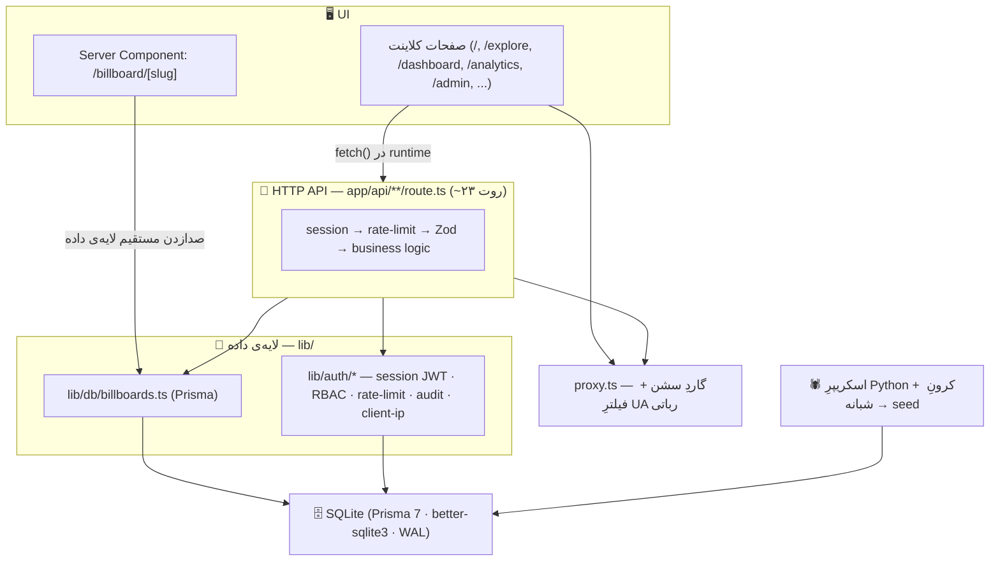

# Rasamap — سامانه یافتن و رزرو رسانه‌های تبلیغاتی محیطی

رساماپ یک بازارگاه آنلاین برای بیلبورد و رسانه‌های محیطی است: کاربر بین چند هزار
رسانه جست‌وجو و فیلتر می‌کند، صفحه‌ی جزئیات را می‌بیند، و بعد از ثبت‌نام با شماره‌ی
موبایل، یک بازه‌ی زمانی را رزرو می‌کند. یک پنل ادمین جدا هم برای مدیریت رسانه‌ها و
رزروها هست. رابط کاربری فارسی و راست‌به‌چپ است.

پروژه‌ی درسی است (پایان‌نامه‌ی کارشناسی). هدف: یک محصولِ کارکننده، تمیز و امن که
جلوی داور دوام بیاورد — نه زیرساختِ نمایشی.

## اجرا

```bash
npm install
cp .env.example .env.local     # مقادیر را پر کن
npx prisma migrate deploy       # ساخت دیتابیس + جدول‌ها
npm run db:seed                 # داده‌ی اولیه (~۳۵۰۰ رسانه)
npm run dev                     # http://localhost:3000
```

برای تست دستی، حساب‌های آماده در [`docs/demo-accounts.md`](./docs/demo-accounts.md)
(‏`npm run db:seed:demo:full`). فهرست کامل دستورها در پایین همین فایل.

نیازمندی‌های محیطی (نام‌ها در `.env.example`): `DATABASE_URL`, `AUTH_SECRET`
(حداقل ۳۲ کاراکتر)، `ADMIN_EMAIL`, `ADMIN_PASSWORD_HASH`, `ADMIN_NAME`, و برای
لایه‌ی نقشه `NESHAN_API_KEY` / `NEXT_PUBLIC_NESHAN_KEY`. اگر یکی از موارد الزامی
نباشد، سرور همان موقع بالا آمدن با پیام صریح متوقف می‌شود (`lib/env.ts`).

---

## پایگاه داده و لایه‌ی داده — چرا این‌طور شد

### از آرایه‌ی ثابت تا دیتابیس

اول کار، داده‌ی بیلبوردها به‌صورت آرایه‌ی هاردکد داخل `lib/data.ts` بود. برای
نمونه‌سازی سریع خوب بود، ولی خیلی زود مشکلش معلوم شد: داده‌ی این پروژه **ثابت
نیست** — اسکریپر شبانه رکورد جدید می‌آورد، ادمین رسانه را ویرایش/حذف می‌کند، و
کاربر رزرو می‌سازد. یک فایل TypeScript نمی‌تواند نوشته شود و همیشه داده‌ی کهنه
می‌دهد. پس رفتیم سراغ یک پایگاه داده‌ی واقعی.

امروز `lib/data.ts` فقط توسط اسکریپت seed خوانده می‌شود تا داده‌ی اولیه را یک‌بار
داخل دیتابیس بریزد؛ هیچ صفحه یا API‌ای دیگر به آن دست نمی‌زند.

### چرا SQLite

انتخاب SQLite یک **تصمیم مهندسی** است، نه یک سازش. SQLite یک موتور SQLِ کامل و
ACID است (همان چیزی که در اندروید، مرورگرها و حتی سیستم‌های هواپیما استفاده
می‌شود) — فقط به‌جای یک سرورِ جدا، یک کتابخانه است که مستقیم روی یک فایل کار
می‌کند. برای بارِ کاریِ این پروژه دقیقاً همان چیزی است که لازم است:

- **خواندن‌محور:** کاتالوگِ ~۳۵۰۰ رکورد که مدام لیست/فیلتر/صفحه‌بندی می‌شود.
  SQLite در خواندن بسیار سریع است، و با حالت **WAL** چند خواننده‌ی هم‌زمان بدون
  قفل شدن کار می‌کنند.
- **یک نقطه‌ی نوشتن:** تنها نوشتنِ تراکنشیِ محصول، ساختِ رزرو است — که کم پیش
  می‌آید و در یک `prisma.$transaction` سریالایز می‌شود.
- **یک نمونه‌ی اجرا (single instance):** برای ارائه‌ی پایان‌نامه، اپ روی یک ماشین
  اجرا می‌شود. نه چند سرورِ اپ داریم که به یک دیتابیسِ مشترک وصل شوند، نه نیاز به
  replication.
- **صفر عملیات:** یک فایل. بدون نصبِ سرور، بدون کاربر/رمزِ دیتابیس، بدون پورت.
  بکاپ = کپیِ یک فایل (`npm run db:backup`، با restore تست‌شده).

چیزهایی که آگاهانه از دست دادیم: نوشتنِ واقعاً هم‌زمان (SQLite در لحظه یک نویسنده
دارد)، دسترسی از چند ماشین، و replication داخلی. هیچ‌کدام در این مقیاس مشکل نیست.
اولین جایی که SQLite کم می‌آورد، زیرِ بارِ سنگینِ **نوشتن** است (قفلِ تک‌نویسنده
روی `POST /api/reservations`) — این را در `docs/architecture.md` صریح گفته‌ایم.

### Prisma چیست و چرا

[Prisma](https://www.prisma.io/) لایه‌ی دسترسی به داده است: یک ORM به‌همراه ابزار
مهاجرت. اسکیمای دیتابیس در یک فایل تعریف می‌شود (`prisma/schema.prisma`)، Prisma
از رویش یک کلاینتِ **type-safe** می‌سازد (کوئری‌ها موقع کامپایل چک می‌شوند، نه
موقع اجرا)، و `prisma migrate` تغییراتِ اسکیما را نسخه‌بندی و قابلِ‌بازپخش می‌کند.

مهم‌تر از همه: کلِ اپ فقط از طریقِ **یک ماژول** (`lib/db/billboards.ts`) با
دیتابیس حرف می‌زند و آن ماژول از Prisma استفاده می‌کند. هیچ روت یا صفحه‌ای مستقیم
`prisma` را صدا نمی‌زند و هیچ SQLِ رشته‌ای در پروژه نیست.

### مسیرِ مهاجرت به بعد

همین که همه‌چیز از Prisma + یک ماژولِ `lib/db/` رد می‌شود، رفتن به Postgres در
آینده یعنی: عوض‌کردنِ `provider` و رشته‌ی اتصال در `datasource`، اجرای مهاجرت‌ها،
تمام — **بدون بازنویسیِ حتی یک کوئری**. دقیقاً به همین دلیل ارزشِ استفاده از ORM
را داشت.

برای پروداکشنِ واقعی (چند نویسنده‌ی هم‌زمان، چند سرورِ اپ، بکاپِ مدیریت‌شده،
replication) گزینه Postgres است. این یک «بعداً»ی برنامه‌ریزی‌شده است، نه یک ضعف.

جدول‌های فعلی: `billboards`, `users`, `reservations`, `reviews`, `admins`,
`audit_logs`. مهاجرت‌ها در `prisma/migrations/`. `dev.db` در `.gitignore` است و
داده‌ی دمو با تگِ `[DEMO]` از داده‌ی واقعی جداست.

---

## معماری در یک نگاه

اپ full-stack Next.js است — UI، HTTP API و رندرِ سمت سرور در یک کدبیس. کدها به
لایه‌های آشنا تقسیم شده‌اند؛ نقشه‌ی کاملِ فایل → لایه در
[`docs/project-reference.md`](./docs/project-reference.md) و تصمیم‌های مهندسی در
[`docs/engineering-decisions.md`](./docs/engineering-decisions.md).



### دو مسیرِ داده — هر دو عمدی

- **مرورگر → HTTP API.** همه‌ی صفحات کلاینت و کامپوننت‌های تعاملی با
  `fetch("/api/...")` کار می‌کنند، چون بعد از لودِ صفحه به داده‌ی تازه و تعاملی
  نیاز دارند (فیلتر، صفحه‌بندی، رزرو).
- **سرور → دیتابیس (مستقیم).** فقط صفحه‌ی `/billboard/[slug]` یک React Server
  Component است که موقع رندر مستقیم `getBillboardBySlug()` را صدا می‌زند — یک
  hop، بدون serialize کردنِ JSON، بدون درخواستِ HTTPِ سرور به خودش. این الگوی
  پیشنهادیِ خودِ Next.js است.

هر دو مسیر از یک لایه‌ی داده (`lib/db/billboards.ts`) رد می‌شوند؛ یک منبعِ حقیقت،
بدون کدِ تکراری. جزئیات + جدولِ مقایسه‌ی پرفورمنس و آنالوژیِ «رستوران/آشپزخانه» در
[`docs/architecture.md`](./docs/architecture.md).

---

## امنیت و صحت — خلاصه

- هر روتِ API: `session check → rate limit → Zod .safeParse() → business logic`.
- احراز هویت: JWTِ HS256 در کوکیِ HttpOnly + SameSite=Strict؛ bcrypt cost 12؛
  پاسخِ یکسان برای «رمز غلط» و «کاربرِ ناموجود» (بدون user enumeration).
- RBAC: `viewer < editor < admin < super_admin` + نقشِ `user`؛ مرزِ امنیت
  endpoint است نه UI.
- Rate limiting پنجره‌ی لغزان، per-IP و per-user؛ IP از `lib/auth/client-ip.ts`
  گرفته می‌شود (نه از اولین مقدارِ `X-Forwarded-For` که قابلِ جعل است).
- رزرو: چکِ هم‌پوشانی + insert داخل یک `prisma.$transaction` — تستِ همزمانی:
  ۱۰ درخواستِ یکسانِ هم‌زمان → دقیقاً یک رزرو.
- لاگِ ساخت‌یافته (`lib/logger.ts`) + کدِ خطای کوتاه برای کاربر؛ auditِ پایدارِ
  عملیاتِ ادمین در جدولِ `audit_logs`.
- headerهای امنیتی + CSP در `next.config.ts`.

جزئیات و ارزیابیِ ۱۳ لایه در [`docs/AUDIT.md`](./docs/AUDIT.md)؛ ممیزیِ
وابستگی‌ها در [`docs/security-audit.md`](./docs/security-audit.md).

---

## دستورها

```bash
npm run dev                # سرورِ توسعه
npm run build              # باید بدون خطا پاس شود
npm run lint
npm test                   # سوییتِ API (node:test) — ۲۵ تست
npm run bench              # بنچمارکِ بار (سرورِ dev باید بالا باشد)

npx prisma migrate deploy  # اعمالِ مهاجرت‌ها
npm run db:seed            # داده‌ی اولیه (~۳۵۰۰ رسانه)
npm run db:seed:demo:full  # حساب‌ها و رکوردهای دمو (docs/demo-accounts.md)
npm run db:backup          # بکاپِ آنلاینِ SQLite → backups/
npm run db:studio          # Prisma Studio
npm run db:dedupe          # گزارشِ رکوردهای تکراری (با -- --apply واقعاً پاک می‌کند)
npm run db:backfill-coords # پرکردنِ مختصاتِ ناقص (نیاز به NESHAN_API_KEY)
```

## اسکریپر

اسکریپرِ Python در `scraper/`؛ جزئیاتِ منابع، زمان‌بندی، پاک‌سازیِ آگهیِ منقضی و
ژئوکدینگ در [`scraper/README.md`](./scraper/README.md).

## مستندات

| فایل | محتوا |
|---|---|
| [`docs/architecture.md`](./docs/architecture.md) | دو مسیرِ داده، آنالوژیِ آشپزخانه، جدولِ پرفورمنس |
| [`docs/engineering-decisions.md`](./docs/engineering-decisions.md) | هر سیستمِ پروژه: چیست، چه ساختاری می‌سازد، چرا، کجا |
| [`docs/api.md`](./docs/api.md) | مرجعِ کاملِ endpointها (در اپ هم: `/api-docs`) |
| [`docs/project-reference.md`](./docs/project-reference.md) | نقشه‌ی فایل → لایه، اسکیما، auth |
| [`docs/AUDIT.md`](./docs/AUDIT.md) · [`PLAN.md`](./PLAN.md) | ارزیابیِ آمادگیِ پروداکشن و کارهای باقی‌مانده |
| [`RUNBOOK.md`](./RUNBOOK.md) · [`PRE_DEPLOY_CHECKLIST.md`](./PRE_DEPLOY_CHECKLIST.md) | رویه‌ی بازیابی و چک‌لیستِ قبل از دیپلوی |
| [`docs/demo-accounts.md`](./docs/demo-accounts.md) | حساب‌های دمو برای تستِ دستی |
